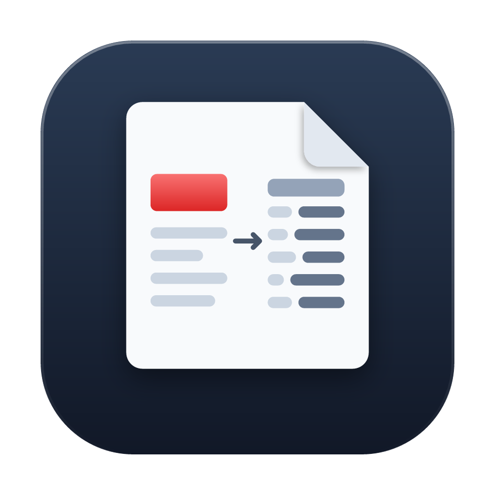
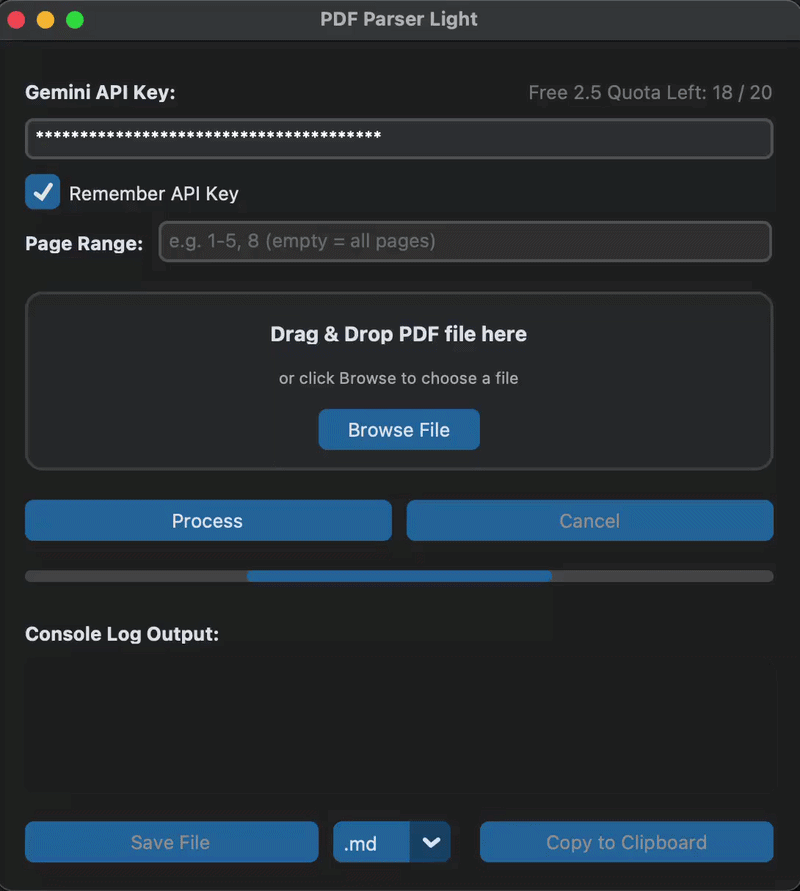
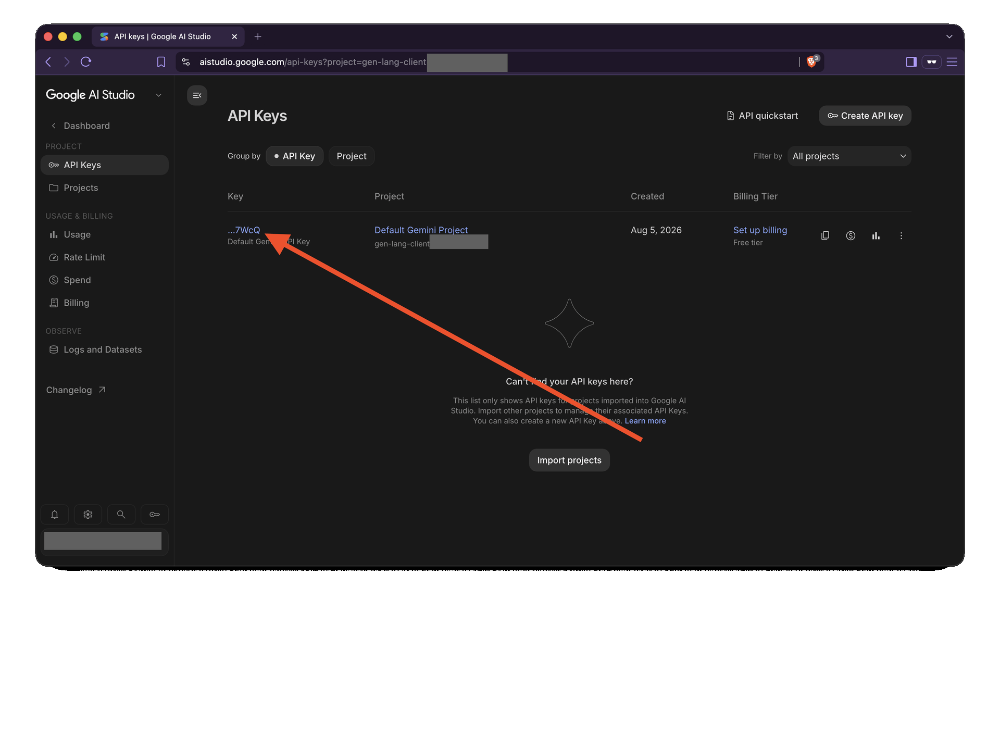
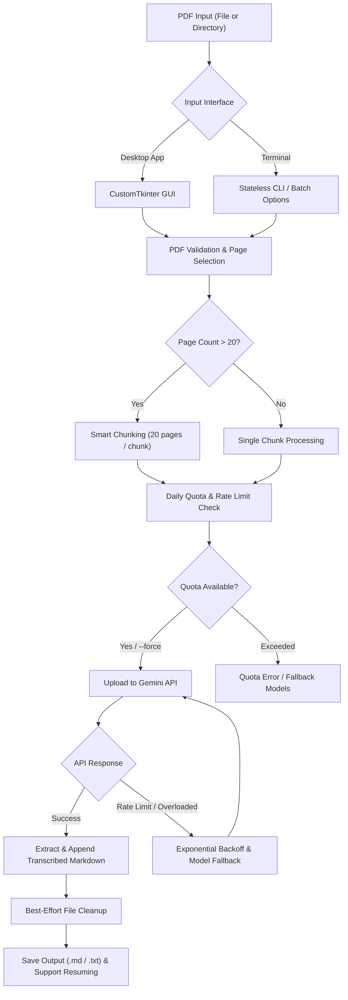

<p align="center">
  
</p>

# PDF Parser Light

[Releases](https://github.com/jtaroreh/pdf-parser-light/releases) A modern, lightweight desktop and command-line application for transcribing PDF files into Markdown/text (incl. LaTeX equations and HTML tables) using the generous free tier of Google Gemini API. Built with Python, CustomTkinter, and automated cross-platform PyInstaller packaging.

<p align="center">
  
</p>

---

## Features

- **High-Fidelity Document Extraction**: Transcribes dense document layouts, preserving formatting, converting equations into LaTeX, and structuring tabular data into HTML or Markdown tables without skipping or summarizing content.
- **Modern Desktop GUI**: Sleek CustomTkinter interface with asynchronous progress tracking, clipboard copy, and file saving (`.md` / `.txt`).
- **Stateless CLI & Batch Mode**: Command-line tool supporting single file parsing and batch directory processing with pacing and error handling.
- **Smart PDF Chunking**: Automatically splits large PDFs (>20 pages) into smaller page chunks to fit within context windows and handle extensive multi-page documents seamlessly.
- **Daily Quota & Rate Limit Protection**: Tracks daily free tier requests locally (20 free requests/day default for primary Flash models) with automatic fallback to high-capacity Flash Lite models (up to 500 requests/day per model) and exponential backoff retry loops on HTTP 429 rate limits.
- **Mid-Chunk Recovery**: Recovers partial transcriptions if processing fails mid-way through a large document.
- **Zero-Cost & Direct API Access**: Connects directly to Gemini API with no middleman SaaS markups, per-page fees, or paid subscription requirements.
- **Local Key Storage**: Saves Gemini API keys locally in platform-specific configuration directories (`0o600` file permissions on POSIX systems; standard user directory on Windows).
- **Cross-Platform**: Executables for macOS, Windows, and Linux.

---

## Why PDF Parser Light?

Many commercial document parsers, math OCR tools, and cloud document APIs impose paywalls, subscription models, or per-page processing fees. **PDF Parser Light** provides a powerful, cost-effective alternative by connecting your device directly to Google Gemini's vision models:

- **Zero API Markup or Subscription Fees**: No third-party SaaS middleman, cloud proxy, or monthly software fees. The app runs completely on your local hardware using your standard API key.
- **Leverages Free Tier Quotas**: Utilizes Google Gemini's generous free daily tier (ranging from 20 requests/day for primary Flash models up to 500+ requests/day across Flash Lite models), enabling hundreds of document pages to be transcribed daily at **$0 cost**.
- **Multimodal LLM Power vs. Legacy OCR**: Traditional OCR software struggles with complex math formulas, multi-column tables, and document hierarchy. Gemini's multimodal vision model extracts inline/block LaTeX equations and structured HTML/Markdown tables with high contextual accuracy in a single pass.

---

## Downloads & Installation

Pre-built standalone executables can be downloaded from the [Releases](https://github.com/jtaroreh/pdf-parser-light/releases) page.

1. **Select your Operating System:**
   - **macOS**: Download `pdf-parser-light-macos.zip`, extract it, and move `PDF Parser Light.app` to your `/Applications` folder.
   - **Windows**: Download `pdf-parser-light-windows.zip`, extract it, and launch `PDF Parser Light.exe`.
   - **Linux**: Download `pdf-parser-light-linux.tar.gz`, extract it, and run `PDF Parser Light`. *(Note: Minimal distributions may require Tcl/Tk libraries via `sudo apt install python3-tk`)*.

### Opening Unsigned Binaries (Security Prompts)

Because standalone releases are built via CI without commercial developer certificates, your OS may present security warnings on first launch:

- **macOS (Gatekeeper)**: If macOS says the app cannot be opened because it is from an unidentified developer, **Control-Click (or Right-Click)** `PDF Parser Light.app`, select **Open**, and click **Open** in the confirmation dialog.
- **Windows (SmartScreen)**: Click **More info**, then click **Run anyway**.

---

## Usage Guide

### Desktop Application (GUI)

<p align="center">
  
</p>

1. Launch **PDF Parser Light**.
2. Enter your **Gemini API Key** from https://aistudio.google.com/api-keys. Check *"Remember API Key"* to save it locally for future sessions.
3. Drag & drop a PDF file onto the window, or click **Browse** to choose a PDF file.
4. Click **Process**. The live console log and progress bar will indicate status.
5. Save the output as Markdown (`.md`) or plain text (`.txt`), or click **Copy to Clipboard**.

### Command Line Interface (CLI)

Install in editable mode or run directly.

> [!TIP]
> **Recommended Workflow**: Setting the `GEMINI_API_KEY` environment variable is the standard and recommended workflow for CLI usage. While `--api-key KEY` is available as a CLI flag, passing keys on the command line can expose them in shell command history (`.bash_history` / `.zsh_history`) and process listings (`ps`, Task Manager).

```bash
# Set your Gemini API Key in the environment (Recommended)
export GEMINI_API_KEY="your_api_key_here"

# Process a single PDF file
pdf-parser-light /path/to/document.pdf --output ./output.md

# Batch process an entire directory of PDFs
pdf-parser-light /path/to/pdf_folder/ --output ./markdown_output/

# Check remaining free requests for today
pdf-parser-light --usage

# Reset local daily free quota tracker
pdf-parser-light --reset-quota

# Force processing ignoring remaining daily quota
pdf-parser-light /path/to/document.pdf --force

# Process a specific page range
pdf-parser-light document.pdf --pages 1-50

# Resume parsing from a previous partial output file
pdf-parser-light document.pdf --resume

# Provide custom transcription instructions
pdf-parser-light document.pdf --prompt "Transcribe equations only into LaTeX."
```

#### CLI Command Options

| Argument | Description |
| :--- | :--- |
| `input_path` | Path to a single `.pdf` file or a directory containing PDF files. |
| `--api-key KEY` | Gemini API Key. Overrides `GEMINI_API_KEY` environment variable. *(Note: Using command-line flags may expose keys in shell history or process listings. Use `GEMINI_API_KEY` env var instead)*. |
| `--output OUT` | Output directory (for batch mode) or output filename (for single file). |
| `--prompt PROMPT` | Custom system prompt override. |
| `--pages PAGES`, `-p` | Page range to process (e.g. `1-50`, `40-120`, or `10`). Default is all pages. |
| `--resume`, `-r` | Resume parsing from previous partial output file instead of starting over. |
| `--usage` | Print remaining daily free requests and exit immediately. |
| `--reset-quota`, `--reset-usage` | Reset local daily free quota tracker to full (0 requests used) and exit immediately. |
| `--force` | Force processing regardless of remaining daily quota limit. |

---

## Daily Quotas & Rate Limits

- **Primary Free Tier Quota**: Defaults to tracking 20 free Gemini 3.5 Flash requests/day locally, matching Google's standard free tier limit (configurable via `GEMINI_FREE_LIMIT` environment variable).
- **High-Capacity Flash Lite Fallbacks**: Google AI Studio provides significantly higher free tier limits for Flash Lite models (`gemini-3.5-flash-lite`, `gemini-3.1-flash-lite`) at up to 500 requests/day per model. Once the 20 primary request limit is reached, the app seamlessly cascades to Flash Lite models.
- **Quota Warnings**: Both GUI and CLI prompt/warn if a multi-chunk document requires more requests than remain in your primary daily quota, allowing seamless fallback execution.
- **Model Fallback Chain**: Tries primary Flash models first (`gemini-3.6-flash`, `gemini-3.5-flash`), then cascades to Lite fallbacks (`gemini-3.5-flash-lite`, `gemini-3.1-flash-lite`). High-demand errors (HTTP 503 / UNAVAILABLE / overloaded) switch to the next model immediately.
- **Automatic Retries**: Retries up to 3 times with exponential backoff on HTTP 429 rate limits or transient failures on the same model before falling back.

---

## Privacy & Security

- **Data Flow**: Selected PDF files are uploaded temporarily to Google Gemini storage using the official `google-genai` SDK for model inference.
- **Data Sensitivity & Privacy Notice**: Do not upload sensitive, confidential, or copyrighted documents. Content is processed on Google servers in accordance with Google Gemini API terms and retention policies.
- **Best-Effort Upload Cleanup**: Uploaded files are deleted from Gemini API storage on a best-effort basis after transcription completes or during normal application cleanup. Deletion failures (e.g. network/API interruptions) or unexpected process crashes may leave temporary files stored until standard Google Gemini retention limits expire.
- **Local Key Storage**: API keys saved via the GUI are stored locally as plain text in user configuration files (`~/Library/Application Support/pdf_parser_light/` on macOS, `%LOCALAPPDATA%\pdf_parser_light\` on Windows, `~/.config/pdf_parser_light/` on Linux) with `0o700` directory and `0o600` file permissions on POSIX systems. On Windows, files are stored within the user profile directory without OS ACL enforcement.

---

## Architecture & Workflow



---

## Developer Guide: Building from Source

### Requirements
- Python 3.9+

### Setup & Testing

```bash
# Clone repository
git clone https://github.com/jtaroreh/pdf-parser-light-test.git
cd pdf-parser-light-test

# Setup virtual environment and dependencies
python3 -m venv venv
source venv/bin/activate
pip install -e ".[test]"

# Run complete unit test suite
pytest -v
```

### Building macOS App Bundle

Run the portable PyInstaller build script:

```bash
chmod +x build.sh
./build.sh
```

The output bundle will be located at `dist/PDF Parser Light.app`.
